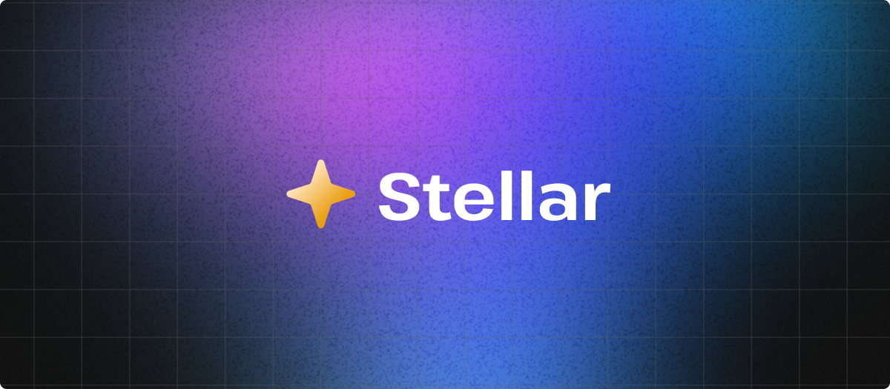

# Stellar

A stellar way to build reactive custom elements.



## Usage

```bash
npm install stellar-element@latest
```

## What is Stellar?

Stellar is a tiny framework for building a specific flavor of web components called "HTML Web Components."

These web components only use the Custom Elements API and do not use any other APIs you might find in the "web components" bucket, such as Shadow DOM or Templates. Instead, the core premise of HTML web components is to write plain HTML and then simply wrap the parts you want to be interactive using a custom element tag.

For example, while a "regular" web component might look something like this...

```html
<counter-button></counter-button>
```

...an HTML web component will look like this:

```html
<counter-button>
  <button>Clicked <span>0</span> times</button>
</counter-button>
```

In the regular web component, component markup is dynamically generated at runtime (using templates and shadow DOM), while the HTML web component simply does the job of hydrating/progressively enhancing existing HTML.

One of the big pain points with HTML web components is that the custom elements API used to build these components is fairly low-level and verbose. Stellar steps in, just like regular web components frameworks (such as Lit or FAST), to improve the ergonomics of building HTML web components.

This is achieved by adding a handful of custom attributes called "directives" that implement event handling and a reactivity model. With Stellar, implementing functionality to the above counter button looks like this:

```html
<counter-button>
  <button @click="increment">
    Clicked <span $state="count">0</span> times
  </button>
</counter-button>

<script type="module">
  import { Stellar } from 'stellar-element';
  class CounterButton extends Stellar {
    increment = () => this.count++;
  }
  customElements.define('counter-button', CounterButton);
</script>
```

Learn more by reading our documentation below.

## Docs

- [Event handling](./docs/event-handling.md)
- [Reactivity](./docs/reactivity.md)
- [Using Stellar and Astro](./docs/using-astro.md)

## Examples

A growing catalog of example code can be found in the [`examples` directory](https://github.com/hawkticehurst/stellar/tree/main/examples) of this repo.

## Learn more about HTML web components

These are some great posts that talk about HTML web components in general –– what they are, how they work, etc.

- [HTML web components](https://adactio.com/journal/20618) - Jeremy Keith
- [HTML Web Components](https://blog.jim-nielsen.com/2023/html-web-components/) – Jim Nielsen
- [HTML Web Components are Just JavaScript?](https://www.oddbird.net/2023/11/17/components/) – Miriam Eric Suzanne
- [HTML Web Components](https://gomakethings.com/html-web-components/) – Chris Ferdinandi

## Similar projects

Stellar is not the only project helping people build HTML web components. Check them out!

- [WebC](https://github.com/11ty/webc)
- [Enhance](https://enhance.dev/)

## License

This project is licensed under [MIT](./LICENSE). Feel free to use, remix, and adapt the code found in this repo in your own projects.
