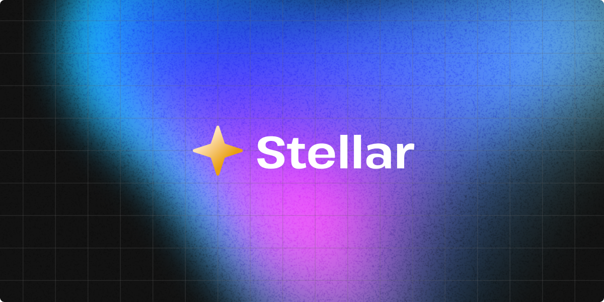

# Stellar

A stellar way to build custom elements.



## Usage

```bash
npm install stellar-element
```

```html
<counter-button>
  <button @click="increment">
    Clicked <span $state="count">0</span> times
  </button>
</counter-button>

<script type="module">
  import { Stellar } from 'stellar-element';
  class CounterButton extends Stellar {
    increment = () => this.count++;
  }
  customElements.define('counter-button', CounterButton);
</script>
```

## What is Stellar?

Todo...

## Philosophy / goals

Todo...

## Docs

- [Getting started](./docs/getting-started.md)
- [Custom elements 101](./docs/custom-elements-101.md)
- [Lifecycle methods](./docs/lifecycle-methods.md)
- [Event handling](./docs/event-handling.md)
- [Reactivity](./docs/reactivity.md)

## License

This is licensed under [MIT](./LICENSE). Feel free to use, remix, and adapt the code found this repo in your own projects.
