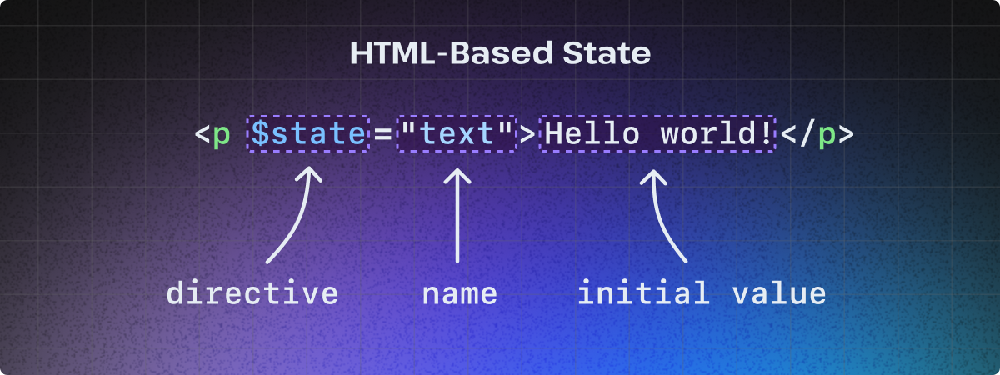

# Reactivity

Stellar, like many other web frameworks, ships a reactivity model that lets you declaratively define pieces of stateful UI.

Unlike other web frameworks, however, state in is defined a little different than what you might have experienced when using tools like React, Svelte, or Vue. In most frameworks, state is defined in JavaScript and then passed into component markup using some type of templating syntax. In Stellar, this relationship is inversed. Reactive state is defined in HTML and then made accessible within JavaScript.

It's called "HTML-based state."

This reactive model is exposed with a handful custom attributes called "directives" that begin with a `$` and can attached to any element within a Stellar component.

Reactive directives include:

- [$state](#$state)
- [$state:_property_](#$state:_property_)
- [$state:html](#$state:html)
- [$bind](#$bind)
- [$bind:_property_](#$bind:_property_)
- [$derive](#$derive)

## $state

Create reactive state tied to an element's text content.

**Syntax**

```
$state="name"
```

_Shorthand:_

```
$="name"
```

**Usage**

The `$state` directive allows you to define a piece of reactive state in HTML that is then made accessible within JavaScript. If you're coming from another web framework, a new concept to become familiar with is that state is automatically initialized based on the existing text content of a stateful element.

When trying to understand a reactive state declaration the following code should be interpreted in the following way:

- The paragraph element is marked as stateful via the `$state` directive
- The name of the state is `text` and can be accessed in JavaScript by calling `this.text`
- The initial value of the state is the string "Hello world!"

```html
<p $state="text">Hello world!</p>
```



To provide a more complete example below, state defined on the span element will be accessible as a reactive property (i.e. `this.count`) in the CounterButton class and will be initialized with the number zero. Accessing state will return the current state and updating the state will automatically update the elements text content.

> [!NOTE]
> As a convenience, all reactive state is coerced to the correct data type when being accessed in JavaScript. For example, when accessing the `count` state below it will be of type `number`.

```html
<counter-button>
  <button @click="increment">
    Clicked <span $state="count">0</span> times
  </button>
</counter-button>

<script type="module">
  import { Stellar } from 'stellar-element';
  class CounterButton extends Stellar {
    constructor() {
      super();
      console.log(this.count); // Logs: 0
    }
    increment = () => this.count++; // Updates state and triggers rerender
  }
  customElements.define('counter-button', CounterButton);
</script>
```

A by-product of this model is that state must _always_ be tied to a DOM node. In the future, this may change with the addition of [DOM Parts API](https://github.com/WICG/webcomponents/blob/gh-pages/proposals/DOM-Parts.md) to browsers, but for now state must be explicitly defined using an HTML element.

**State starts in the server**

An intentional goal of this model is to be extremely SSR-friendly and align (mostly) well with [hypermedia-driven principles](https://hypermedia.systems/). When used in a framework like Astro, initial component state can start in the server, be encoded directly into your HTML, and then be seamlessly hydrated on the client without any layout shift issues or flashes of new content once JavaScript is executed.

```astro
---
// State starts in the server!
const initial = "Hello world!"
---

<log-text>
  <p $state="text">{initial}</p>
</log-text>

<script>
  import { Stellar } from 'stellar-element';
  class LogText extends Stellar {
    constructor() {
      super();
      console.log(this.text) // Logs "Hello world!"
      this.text = "Hey there!" // Rerender paragraph element with text "Hey there!"
      console.log(this.text) // Logs "Hey there!"
    }
  }
  customElements.define('log-text', LogText);
</script>
```

**Scoping state**

It is recommended that you scope your state to be as small as possible. In practice this usually means using a lot of `<span>` tags within your markup to denote pockets of reactivity.

```html
<hello-message>
  <button @click="hello">Click for message</button>
  <p>Message: <span $state="message"></span></p>
</hello-message>

<script type="module">
  import { Stellar } from 'stellar-element';
  class HelloMessage extends Stellar {
    hello = () => {
      this.message = 'Hey there!';
    };
  }
  customElements.define('hello-message', HelloMessage);
</script>
```

**Initializing state in JavaScript**

If for whatever reason you can't or don't want to rely on auto-initialization of state based on the text content of a stateful element, you can always manually initialize the state in the `constructor` method of any Stellar component.

> [!WARNING]
> This method of initializing state runs the risk of causing visual instability and layout issues since the initially rendered reactive HTML will not contain any content until JavaScript is parsed and executed.

```html
<counter-button>
  <button @click="increment">
    <!-- Count state has no HTML-based initial value -->
    Clicked <span $state="count"></span> times
  </button>
</counter-button>

<script type="module">
  import { Stellar } from 'stellar-element';
  class CounterButton extends Stellar {
    constructor() {
      super();
      this.count = 0; // Count is initialized here!
      console.log(this.count); // Logs: 0
    }
    increment = () => this.count++; // Updates state and triggers rerender
  }
  customElements.define('counter-button', CounterButton);
</script>
```

## $state:_property_

Create reactive state tied to an element property.

**Syntax**

```
$state:property="name"
```

_Shorthand:_

```
$property="name"
```

**Usage**

Similar, to the `$state` directive this will create a piece of state, but instead of reactively updating the element's text content changes to state created with the `$state:property` directive will update an element's property.

## $state:html

Create reactive state tied to an element's inner HTML.

**Syntax**

```
$state:html="name"
```

_Shorthand:_

```
$html="name"
```

**Usage**

Similar, to the `$state` directive this will create a piece of state, but instead of reactively updating the element's text content changes to state created with the `$state:html` directive will update an element's inner HTML.

## $bind

Bind an element's text content to some existing state.

**Syntax**

```
$bind="statename"
```

**Usage**

The `$bind` directive can be thought of as a way to reflect existing state (unaltered) somewhere else in your component. If you're looking to create new (alterted) state based on other state, see the [`$derive` directive](#derive).

The `$bind` directive accepts the name of some state that has been defined elsewhere (using the `$state` or `$state:property` directives) and ties (or shall we say "binds") the state and the bound element together –– whenever the state changes the bound element's text content will change as well.

```html
<bound-values>
  <button @click="increment">
    Clicked <span $state="count">0</span> times
  </button>
  <p>Bound to count state: <span $bind="count">0</span></p>
</bound-values>

<script type="module">
  import { Stellar } from 'stellar-element';
  class BoundValues extends Stellar {
    increment = () => this.count++;
  }
  customElements.define('bound-values', BoundValues);
</script>
```

If it helps, in other web frameworks the above markup would usually look something like this:

```html
<!-- This is fake psuedo-code! -->
<button>Clicked {count} times</button>
<p>Bound to count state: {count}</p>
```

You can think of this as Stellar's way of working around not using a templating syntax and comes as a consequence of encoding state declarations into HTML.

## $bind:_property_

Bind an element property to some existing state.

**Syntax**

```
$bind:property="statename"
```

**Usage**

Like the `$bind` directive, `$bind:property` is a way of reflecting existing state (unaltered) to an element's property, such as the `value` property.

Unlike `$bind`, however, `$bind:property` takes inspiration from projects like Svelte and Vue by implementing two way data flow. This means not only will changing the state change the bound property, but changing the property will change the state.

The canonical example of this functionality is binding a text field's value property to some state. When typing into the text field the `value` property is changed, but since that property is bound to the `name` state it will automatically be updated as well. The effect is that as you type, both the text field and span element will render the changes.

> [!NOTE]
> To achieve the best experience when using SSR it's good practice to explicitly define the initial value of your bound property (as seen with `value="world"` in the example below). This avoids a flash of new content once JavaScript is loaded and the state is synced with the property.

```html
<hello-world>
  <input type="text" $bind:value="name" value="world" />
  <p>Hello <span $state="name">world</span>!</p>
</hello-world>

<script type="module">
  import { Stellar } from 'stellar-element';
  class HelloWorld extends Stellar {}
  customElements.define('hello-world', HelloWorld);
</script>
```

To be clear, this directive is syntactic sugar and the same functionality could be achieved by manually adding an `@input` event directive that triggers a callback method that will sync that text field `value` with the `name` state.

```html
<hello-world>
  <input type="text" @input="sync" value="world" />
  <p>Hello <span $state="name">world</span>!</p>
</hello-world>

<script type="module">
  import { Stellar } from 'stellar-element';
  class HelloWorld extends Stellar {
    sync = (event) => {
      this.name = event.target.value;
    };
  }
  customElements.define('hello-world', HelloWorld);
</script>
```

However, like Svelte [says in their tutorial](https://learn.svelte.dev/tutorial/text-inputs) doing this every time you want to sync the changes between a property and some state feels "a bit... boilerplatey." So we'll happily take the convenience of some sugar.

## $derive

Derive new state based on existing state(s).

**Syntax**

```
$derive="callback(...statenames)"
```

**Usage**

Todo...
